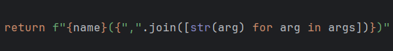

$${\textbf{Luanon} \space \textbf{Python} \space \textbf{Library}}$$

$${An \space intellectual \space product \space of \space \color{lightyellow}Lua \space \color{lightgreen}Non \space \color{lightblue}Team}$$

  <kbd></kbd>

---

# Dear Cloudflare Team

- I know that you will visit this project in someday.
- In fairness, you exist, just as we do.
- You protect websites for money.
- Likewise, I sell this bypass API for money.
- Let's enjoy my project, there's no need for anger😊😊😊

# Note

- Current version: 0.0.0
- Why must use python 3.12?

    

- I don't want to use `f"Hello {''.join(['d', 'a', 'd'])}!"`.
- I want to use `f"Hello {"".join(["d", "a", "d"])}!"`.

# Project Tree

| Module           | Python  | Status      | Author(s)           | Description                                               |
|------------------|---------|-------------|---------------------|-----------------------------------------------------------|
| cloudscraper_new | >= 3.12 | Working     | @luanon404          | Will rename to cloudscraper in release 1.0.0.             |
| cloudscraper     | >= 3.12 | Maintenance | @luanon404, @To_Duy | Will remove in release 1.0.0.                             |
| hcaptcha         | >= 3.12 | Maintenance | @luanon404          | Bypass hCaptcha by using the requests library.            |
| image            | >= 3.12 | Maintenance | @luanon404          | Image processor for an auto AI sub-library (future-task). |
| js_runtime_new   | >= 3.12 | Working     | @luanon404          | Will rename to js_runtime in release 1.0.0.               |
| js_runtime       | >= 3.12 | Done        | @luanon404          | Will remove in release 1.0.0.                             |
| webdriver        | ?       | Maintenance | @luanon404          | Android WebDriver client                                  |

---

$${\textbf{©2023 LuaNonTeam. All Rights Reserved.}}$$
