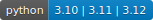

$${\textbf{Luanon} \space \textbf{Python} \space \textbf{Library}}$$

$${An \space intellectual \space product \space of \space \color{lightyellow}Lua \space Non \space \color{lightblue}Team}$$

---

- Supported Python version: 

# Project Tree

| Library      | Status                  | Author(s)           | Description                                                                          |
| ------------ | ----------------------- | ------------------- | ------------------------------------------------------------------------------------ |
| cloudscraper | Maintenance             | @luanon404, @To_Duy | Bypass Cloudflare by using the requests library.                                     |
| hcaptcha     | Maintenance             | @luanon404          | Bypass hCaptcha by using the requests library.                                       |
| image        | Maintenance             | @luanon404          | Image processor for an auto AI sub-library (future-task).                            |
| js_runtime   | Future Merge with jsdom | @luanon404          | Run JS in Python syntax.                                                             |
| webdriver    | Working                 | @luanon404          | Android WebDriver client                                                             |

---

$${\textbf{©2023 LuaNonTeam. All Rights Reserved.}}$$
